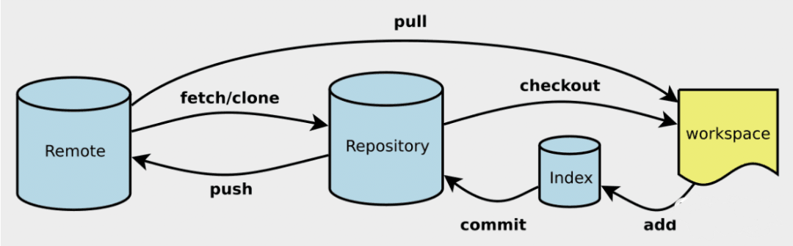

# WW1课程小结

第一周 2021.2.23

### 课程内容

+ 课程团建
+ Markdown与Typora简介
  + Md语法简介明了，是使用Github配套的文档
  + Typora：简洁的Md文档编辑器
  + md基本语法，画图，数学公式
+ Git与GitHub简介
  + Git是一套实现分布式版本管理的协议，核心是Repo仓库及其管理
  + GitHub对协议进行封装，便于操作
  + 动手在GitHub上操作：fork,  add, commit, pull request,
  + 在命令行试验操作：clone, add, commmit, push
  + 了解branch等功能

### 感受与建议

1. 课程团建略尴尬，建议提前按照之前的分组
2. Git命令行有些难懂
3. 老师助教水平高、认真负责
